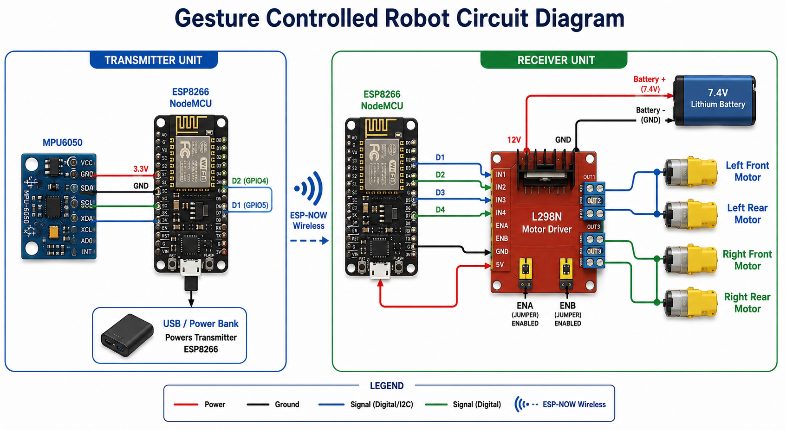

# Gesture-Control-BOT Robot using ESP8266 and MPU6050

A wireless hand-gesture-controlled robot built using two ESP8266 NodeMCU boards, an MPU6050 sensor, ESP-NOW communication, and an L298N motor driver.

## Project Overview

This project enables a robot to move according to hand gestures. The user wears or holds a transmitter module containing an MPU6050 accelerometer and an ESP8266. Hand movements are detected and converted into commands, which are transmitted wirelessly using ESP-NOW to another ESP8266 mounted on the robot.

The receiver ESP8266 processes the commands and controls the motors through an L298N motor driver.

## Features

- Wireless communication using ESP-NOW
- Real-time gesture recognition
- Forward, backward, left, right, and stop controls
- Low-cost and easy-to-build system
- Expandable for speed control and additional gestures

---

## Components Used

### Transmitter Unit

- ESP8266 NodeMCU
- MPU6050 Accelerometer and Gyroscope
- Power bank / 18650 battery
- Breadboard and jumper wires

### Receiver Unit

- ESP8266 NodeMCU
- L298N Motor Driver
- 2 DC Geared Motors
- Robot chassis
- Wheels and caster wheel
- 7.4V battery pack
- Jumper wires

---



## Hardware Connections

### MPU6050 → ESP8266 (Transmitter)

| MPU6050 | ESP8266    |
| ------- | ---------- |
| VCC     | 3.3V       |
| GND     | GND        |
| SDA     | D2 (GPIO4) |
| SCL     | D1 (GPIO5) |

### L298N → ESP8266 (Receiver)

| L298N | ESP8266 |
| ----- | ------- |
| IN1   | D1      |
| IN2   | D2      |
| IN3   | D3      |
| IN4   | D4      |

### Motor Connections

| Motor       | L298N      |
| ----------- | ---------- |
| Left Motor  | OUT1, OUT2 |
| Right Motor | OUT3, OUT4 |

### Power Connections

- Battery (+) → L298N 12V
- Battery (-) → L298N GND
- L298N 5V → ESP8266 Vin
- ESP8266 GND → L298N GND

> **Important:** Ensure all grounds are connected together.

---

## Software Requirements

- Arduino IDE
- ESP8266 Board Package
- Libraries:
  - Wire.h
  - ESP8266WiFi.h
  - espnow.h
  - MPU6050.h

---

## Installation

1. Clone this repository:

```bash

https://github.com/shubhambisoyi1-glitch/Gesture-Control-BOT.git
```
